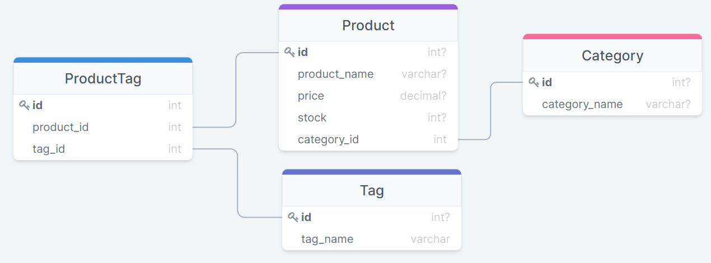

<h2 align="center">Object-Relational Mapping (ORM) Challenge: E-commerce Back End</h2>

---

<div align="center">

<h5 align="center">

💼 Module 13 Challenge 💼<br>
By Clayton Skaggs<br>
(WW26.1) / June 27th 2022

Version 0.1</h5>
</div>

<br>
<br>


<h3 align="center">🚀 🚀 Deployment Information 🚀 🚀</h3>

---

<div align="center">
<h3> Hosted by Heroku</h3>

````
git clone git@github.com:DesertCow/Sequelize-Weasel.git
cd Sequelize-Weasel/
npm init -y
npm i
node server.js

````


</div>

<br>
<br>
<br>
<br>

<h3 align="center">🧙‍♂️ 🧙‍♂️ User Story 🧙‍♂️ 🧙‍♂️</h3>

----

<p><b>AS A</b> manager at an internet retail company<br>
<b>I WANT</b> a back end for my e-commerce website that uses the latest technologies<br>
<b>SO THAT I</b> my company can compete with other e-commerce companies</p>

<br>
<br>
<br>

<h3 align="center">🌟 🌟 Acceptance Criteria 🌟 🌟</h3>

---
<p align="center"> <b>GIVEN</b> a functional Express.js API<br><br></p>
<p align="left"><b>WHEN</b> I add my database name, MySQL username, and MySQL password to an environment variable file<br>
✔️  THEN I am able to connect to a database using Sequelize<br>
<b>WHEN</b> I enter schema and seed commands<br>
✔️  THEN a development database is created and is seeded with test data<br>
<b>WHEN</b> I enter the command to invoke the application<br>
✔️  THEN my server is started and the Sequelize models are synced to the MySQL database<br>
<b>WHEN</b> I open API GET routes in Insomnia Core for categories, products, or tags<br>
✔️  THEN the data for each of these routes is displayed in a formatted JSON<br>
<b>WHEN</b> I test API POST, PUT, and DELETE routes in Insomnia Core<br>
✔️ THEN I am able to successfully create, update, and delete data in my database<br>
<br>
<br>
<br>

<h3 align="center">💾 💾 Database Diagram 💾 💾</h3>

---
<p align="center">
  

<br>
<br>
<br>

<h3 align="center">⚡ ⚡ App Demo ⚡ ⚡</h3>

---

<br>
<br>
<h4 align="center">Seed Database / Start Application</h4>
<p align="center">
<iframe width="560px" height="320px" allowfullscreen="true" allow="autoplay *" src="https://bootcampspot.instructuremedia.com/embed/74158760-442a-4111-9484-1c547f772233" frameborder="0"></iframe>
</p>

<br>
<br>
<h4 align="center">GET Demo</h4>
<br>
<p align="center">
<iframe width="560px" height="320px" allowfullscreen="true" allow="autoplay *" src="https://bootcampspot.instructuremedia.com/embed/ff58f969-2af7-46df-8009-0e4735510929" frameborder="0"></iframe>
</p>

<br>
<br>
<h4 align="center">GET by ID Demo</h4>
<br>
<p align="center">
<iframe width="560px" height="320px" allowfullscreen="true" allow="autoplay *" src="https://bootcampspot.instructuremedia.com/embed/e1ffda9f-396d-425e-a525-a30d65e71d01" frameborder="0"></iframe>
</p>
<br>
<br>

<h4 align="center">POST/PUT/DELETE</h4>
<br>
<p align="center">
<iframe width="560px" height="320px" allowfullscreen="true" allow="autoplay *" src="https://bootcampspot.instructuremedia.com/embed/5c4b43ba-b5ad-4c14-b39f-a000b69f65ae" frameborder="0"></iframe>
</p>
<br>
<br>

<h3 align="center">📦 📦 NPM Package Information 📦 📦</h3>

-----

````

npm i express
npm i MySQL2
npm i Sequelize
npm i dotenv
npm i inquirer@8.2.4

````

<br>

<br>
<br>
